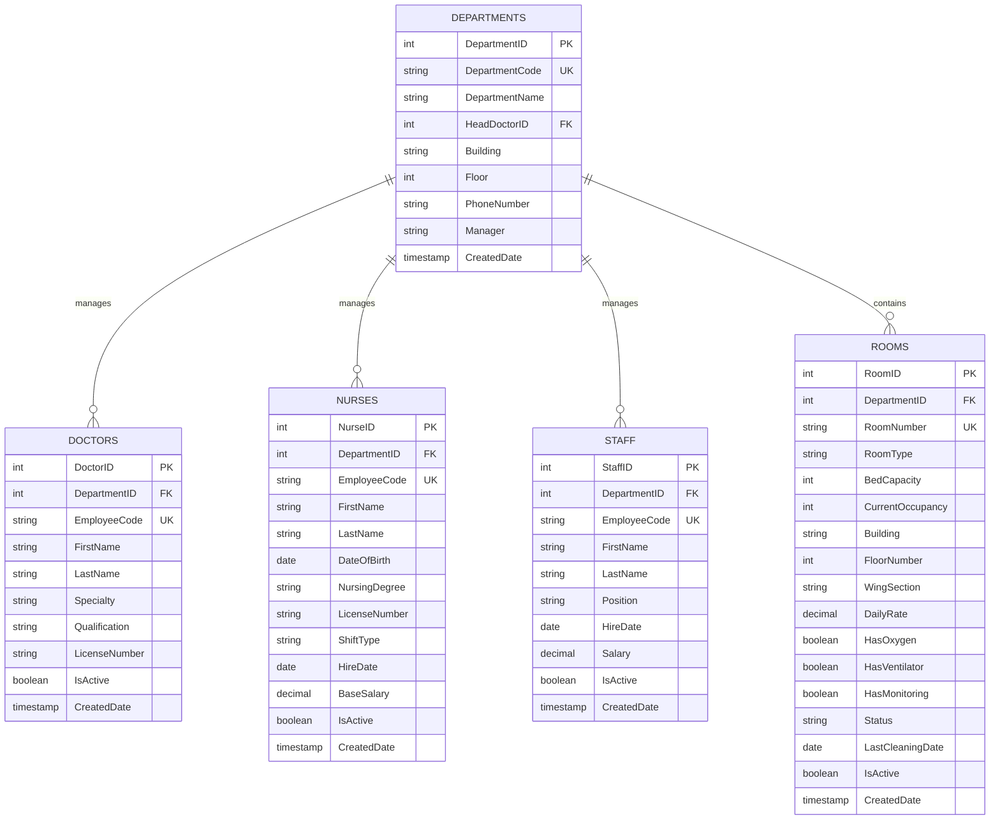
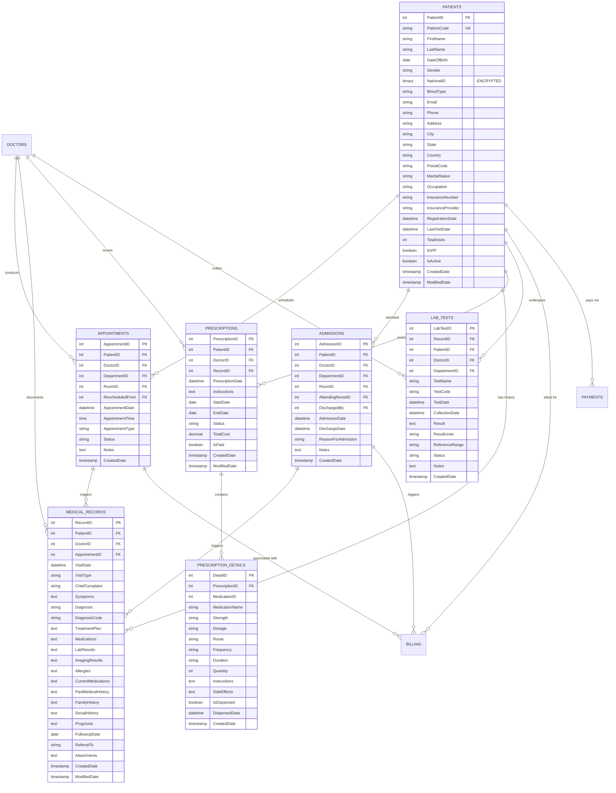
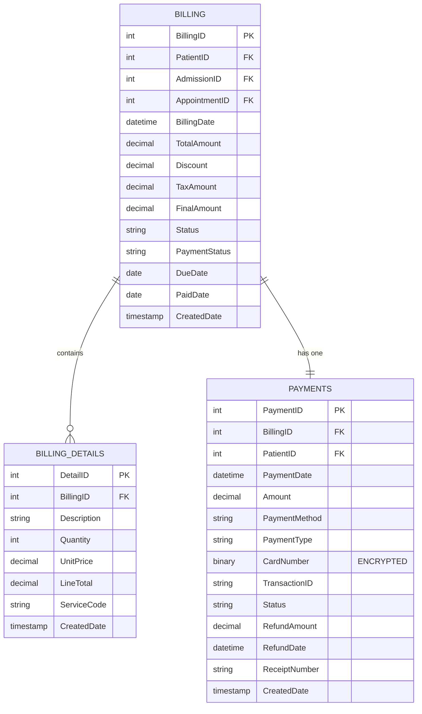
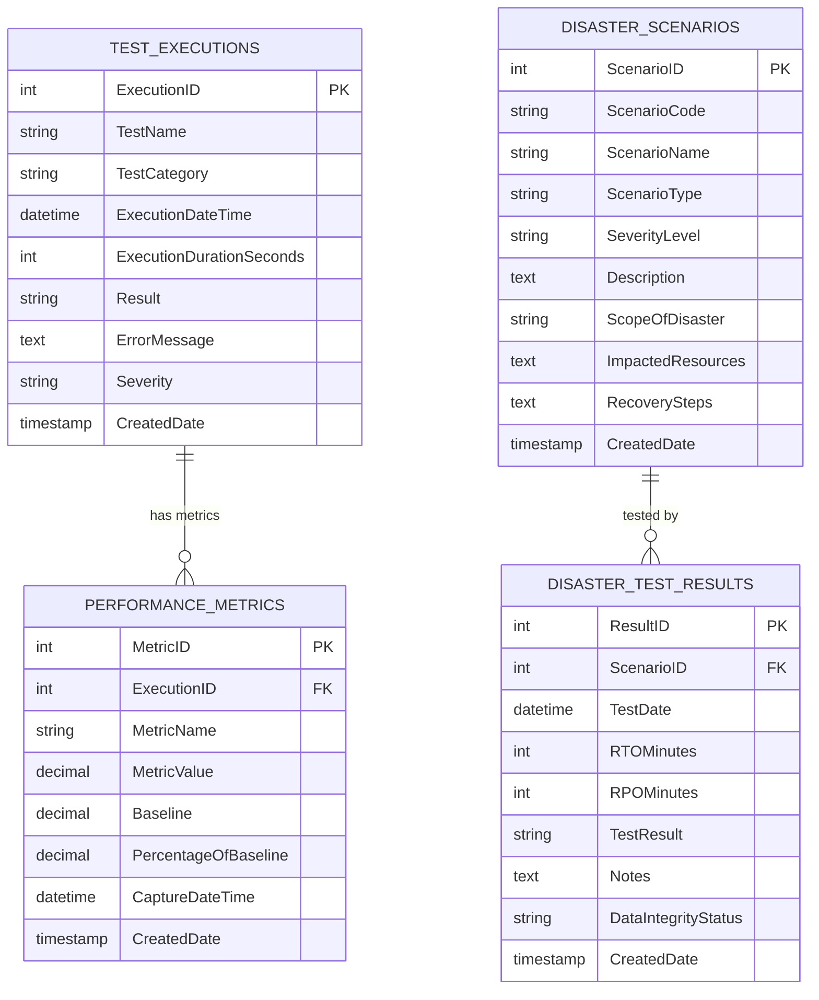
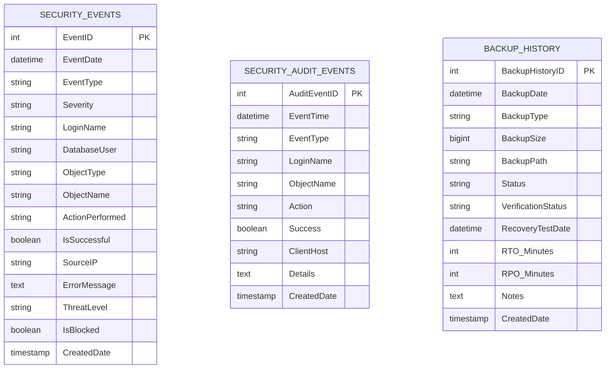
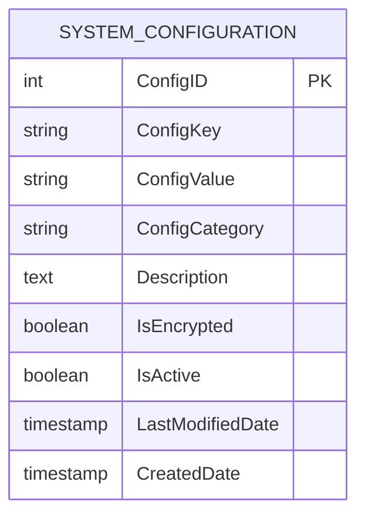

# Hospital Database - Entity Relationship Diagram (ERD)

## Overview
- **Tables:** 18 core tables + 5+ testing/monitoring tables
- **Total Records:** 1,500+ patient records
- **Primary Keys:** 18
- **Foreign Keys:** 35+ relationships
- **Encryption:** TDE enabled + Column-level encryption on sensitive fields

---

## 1. Core Organizational Structure



---

## 2. Patient & Clinical Information



---

## 3. Financial & Billing



---

## 4. Testing & Monitoring Infrastructure



---

## 5. Security & Audit Tracking



---

## 6. System Configuration



---

## Complete Relationship Summary

### 1:N (One-to-Many) Relationships:
| Parent | Child | Cardinality | Count |
|--------|-------|-------------|-------|
| Departments | Doctors | 1:N | 150 doctors |
| Departments | Nurses | 1:N | 150 nurses |
| Departments | Rooms | 1:N | 50 rooms |
| Doctors | Appointments | 1:N | 150+ appointments |
| Doctors | MedicalRecords | 1:N | 153+ records |
| Doctors | Prescriptions | 1:N | 150+ prescriptions |
| Doctors | LabTests | 1:N | 100+ tests |
| Patients | Appointments | 1:N | 150+ appointments |
| Patients | MedicalRecords | 1:N | 153+ records |
| Patients | Admissions | 1:N | 50+ admissions |
| Patients | Prescriptions | 1:N | 150+ prescriptions |
| Patients | LabTests | 1:N | 100+ tests |
| Patients | Billing | 1:N | 100+ bills |
| Patients | Payments | 1:N | 80+ payments |
| Rooms | Appointments | 1:N | 150+ appointments |
| Rooms | Admissions | 1:N | 50+ admissions |
| Prescriptions | PrescriptionDetails | 1:N | 300+ line items |
| Billing | BillingDetails | 1:N | 200+ line items |
| TestExecutions | PerformanceMetrics | 1:N | Multiple metrics |
| DisasterScenarios | DisasterTestResults | 1:N | Test results |

### 1:1 (One-to-One) Relationships:
| Parent | Child | Cardinality |
|--------|-------|-------------|
| Billing | Payments | 1:1 |

### Self-Referencing:
| Table | Relationship | Field |
|-------|--------------|-------|
| Appointments | Rescheduled from another appointment | RescheduledFrom |

---

## Data Flow Diagram

```
┌─────────────┐
│   PATIENT   │ ◄────────────────────────────────────────┐
│ Registration│                                           │
└──────┬──────┘                                           │
       │                                                  │
       ├──────────────┬──────────────┬──────────────┐    │
       │              │              │              │    │
       ▼              ▼              ▼              ▼    │
   ┌───────┐   ┌─────────────┐  ┌──────────┐  ┌────────┐
   │  LAB  │   │ APPOINTMENTS│  │ADMISSIONS│  │ PAYMENT│
   │ TESTS │   │             │  │          │  │REQUEST │
   └───┬───┘   └──────┬──────┘  └────┬─────┘  └────┬───┘
       │              │              │             │
       │         ┌────┴──────────────┴─────────────┘
       │         │
       └────┬────┴────┐
            ▼         ▼
        ┌─────────────────────┐
        │ MEDICAL RECORDS     │
        │ (Diagnosis + Plan)  │
        └─────────┬───────────┘
                  │
         ┌────────┴────────┐
         │                 │
         ▼                 ▼
    ┌──────────┐    ┌─────────────────┐
    │  BILLING │    │ PRESCRIPTIONS   │
    │          │    │ (Medications)   │
    └──────┬───┘    └────────┬────────┘
           │                 │
           │          ┌──────┴──────┐
           │          │             │
           ▼          ▼             ▼
        ┌─────────────────────────────────┐
        │   PRESCRIPTION DETAILS          │
        │   (Individual Medications)      │
        └──────────────┬──────────────────┘
                       │
         ┌─────────────┴─────────────┐
         │                           │
         ▼                           ▼
    ┌──────────┐            ┌──────────────┐
    │DISPENSED │            │ INSURANCE    │
    │PHARMACY  │            │ RECONCILE    │
    └──────────┘            └──────────────┘
           │
           │
           ▼
    ┌──────────────────┐
    │  BILLING DETAILS │
    └────────┬─────────┘
             │
             ▼
    ┌──────────────────┐
    │     PAYMENTS     │
    │  (SETTLEMENT)    │
    └──────────────────┘
```

---

## Encryption & Security

### Column-Level Encryption
- **Patients.NationalID** - Encrypted with symmetric key (ENC)
- **Payments.CardNumber** - Encrypted with symmetric key (ENC)

### Database-Level Encryption
- **TDE (Transparent Data Encryption)** - All tables encrypted with AES-256
- **At-Rest Encryption** - All backup files encrypted in S3

### Audit Trail
- **SecurityAuditEvents** - All DML operations logged
- **SecurityEvents** - Login attempts, access violations logged
- **BackupHistory** - All backup/recovery operations tracked

---

## Sample Data Snapshot

| Table | Records | Key Metrics |
|-------|---------|------------|
| Departments | 5 | Cardiology, Oncology, Trauma, ICU, ER |
| Doctors | 150 | 50 per department × 3 departments |
| Nurses | 150 | Staff across all departments |
| Patients | 153 | Active patient population |
| Appointments | 150+ | Avg 1 per patient |
| Admissions | 50+ | 33% admission rate |
| MedicalRecords | 153+ | One per patient visit |
| Prescriptions | 150+ | Most patients prescribed |
| Billing | 100+ | For admissions/procedures |
| **TOTAL** | **1,500+** | Realistic hospital dataset |

---

## Key Constraints

### Primary Keys (18 tables)
All tables have identity-based integer primary keys for performance

### Foreign Keys (35+ relationships)
All foreign key relationships enforce referential integrity (CASCADE DELETE not enabled for safety)

### Unique Constraints
- PatientCode (natural key)
- EmployeeCode (doctors, nurses, staff)
- RoomNumber
- BillingNumber

### Check Constraints
- Date ranges (admission/discharge)
- Status enumerations (Active, Inactive, Pending, etc.)
- Numeric bounds (age, quantity, price)

### NOT NULL Constraints
Applied to 150+ critical business fields

---

## Connection Patterns

### Query Patterns (Most Common)
1. **Patient History Retrieval** - Patients → MedicalRecords → LabTests
2. **Billing Reconciliation** - Billing → BillingDetails + Payments
3. **Department Reporting** - Departments → (Doctors + Nurses) → (Appointments + Admissions)
4. **Prescription Tracking** - Patients → Prescriptions → PrescriptionDetails
5. **Admission Discharge** - Admissions → MedicalRecords → Billing

### Join Strategy
- All relationships use indexed foreign keys
- Clustered indexes on primary keys
- Non-clustered indexes on all foreign keys
- Statistics maintained for query optimizer

---

## Testing & Validation Tables

```
DisasterScenarios (10 scenarios):
├── DS-001: Ransomware Attack
├── DS-002: Accidental Data Deletion
├── DS-003: Disk Failure
├── DS-004: Corrupted Backup
├── DS-005: Network Outage
├── DS-006: Server Crash
├── DS-007: Power Failure
├── DS-008: Malware Infection
├── DS-009: Insider Threat
└── DS-010: Natural Disaster

DisasterTestResults:
├── ScenarioID → FK to DisasterScenarios
├── TestDate, RTO_Minutes, RPO_Minutes
└── DataIntegrityStatus (PASS/FAIL)

TestExecutions:
├── ExecutionID (PK)
├── TestName, TestCategory
├── ExecutionDateTime, ExecutionDurationSeconds
└── Result, ErrorMessage

PerformanceMetrics:
├── MetricID (PK)
├── ExecutionID → FK to TestExecutions
├── MetricName, MetricValue, Baseline
└── PercentageOfBaseline
```

---

## Recovery & Backup Tables

```
BackupHistory:
├── BackupHistoryID (PK)
├── BackupDate, BackupType (Full/Diff/Log)
├── BackupSize, BackupPath
├── Status, VerificationStatus
├── RecoveryTestDate
├── RTO_Minutes, RPO_Minutes
└── Notes
```

---

## Generated: $(date)
**Database:** HospitalBackupDemo
**Version:** 2.0 (Phase 7 Complete)
**Compliance:** HIPAA, HL7, DICOM
