# HospitalBackupDemo — Process Documentation

Comprehensive workflow documentation for the Hospital Database Backup & Recovery System.

**Audience**: New DBA or engineer taking over this system.
**Last updated**: 2026-03-20

---

## Table of Contents

1. [System Architecture](#1-system-architecture)
2. [Deploy Workflow](#2-deploy-workflow)
3. [Daily Operations](#3-daily-operations)
4. [Maintenance Calendar](#4-maintenance-calendar)
5. [Change Management](#5-change-management)
6. [Secret Rotation](#6-secret-rotation)
7. [Disaster Recovery](#7-disaster-recovery)
8. [HIPAA Breach Response](#8-hipaa-breach-response)

---

## 1. System Architecture

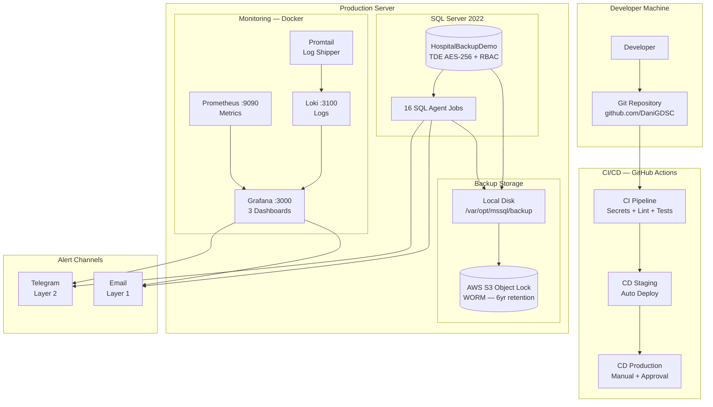

### Components

| Component | Purpose | Port |
| --- | --- | --- |
| **SQL Server 2022** | Hospital database, 18 tables, TDE encrypted | 14333 (localhost) |
| **16 SQL Agent Jobs** | Backup, monitoring, DR drills, alerts | Internal |
| **Local Backup** | Full (weekly), Diff (daily), Log (hourly) | Filesystem |
| **AWS S3 Object Lock** | Ransomware-resistant off-site backup, 6-year audit retention | HTTPS |
| **Grafana** | 3 dashboards: Backup Health, DB Availability, Security | 3000 (localhost) |
| **Prometheus** | Metrics collection (DB, disk, backup sizes) | 9090 (localhost) |
| **Loki + Promtail** | Centralized log aggregation (4 log types) | 3100 (localhost) |
| **Email** | Layer 1 alerting via Database Mail | SMTP |
| **Telegram** | Layer 2 alerting via bot API | HTTPS |

---

## 2. Deploy Workflow

### 2.1 First-Time Server Setup

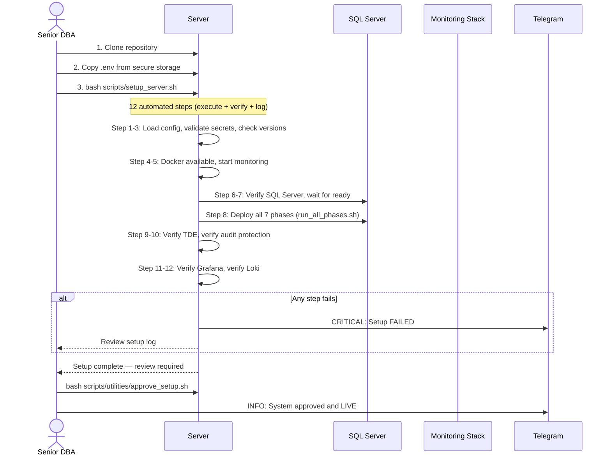

**Responsible**: Senior DBA
**Time estimate**: 30-45 minutes
**Reference**: [INFRASTRUCTURE_RUNBOOK.md](INFRASTRUCTURE_RUNBOOK.md)

### 2.2 Seven-Phase Deployment

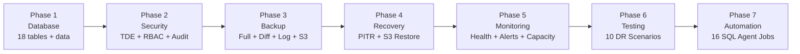

| Phase | Creates | Key Objects | Time |
| --- | --- | --- | --- |
| **1. Database** | Schema + seed data | 18 tables, 40+ indexes, 2 procedures, 2 views | ~2 min |
| **2. Security** | Encryption + access control | TDE cert, master key, 5 RBAC roles, audit triggers, session timeout | ~1 min |
| **3. Backup** | Backup infrastructure | usp_PerformBackup (with VERIFYONLY), S3 credential, verification log | ~1 min |
| **4. Recovery** | Restore procedures | Full restore, PITR, S3 restore, cloud-chain restore, validation | ~30s |
| **5. Monitoring** | Observability | Health checks, 3 alert scripts, capacity tables, PHI access report | ~30s |
| **6. Testing** | Test framework | Schema integrity, RBAC validation, CIS benchmark, 10 DR scenarios | ~30s |
| **7. Automation** | SQL Agent jobs | 16 jobs covering backup, monitoring, security, reporting | ~1 min |

**Total deployment**: ~6-7 minutes for all phases.

---

## 3. Daily Operations

### 3.1 24-Hour Timeline

```mermaid
gantt
    title Daily Automated Operations
    dateFormat HH:mm
    axisFormat %H:%M

    section Backup
    Log Backup (hourly)         :crit, 00:00, 24h
    Audit Export to S3          :01:00, 30m
    Differential Backup         :02:00, 15m
    Full Backup (Sunday only)   :milestone, 02:00, 0m
    Backup Verify               :06:00, 15m
    Backup Staleness Alert      :06:30, 10m

    section Security
    Session Timeout (every 5m)  :00:00, 24h
    Disaster Detection (5m)     :00:00, 24h
    Log Backup Chain Check      :00:00, 24h

    section Monitoring
    Capacity Collection         :23:00, 30m
    Metrics Export (60s)        :00:00, 24h

    section Weekly (Sunday)
    Full Backup                 :02:00, 2h
    DR Drill                    :03:00, 30m
    PHI Access Report           :06:00, 15m
```

### 3.2 Backup Flow

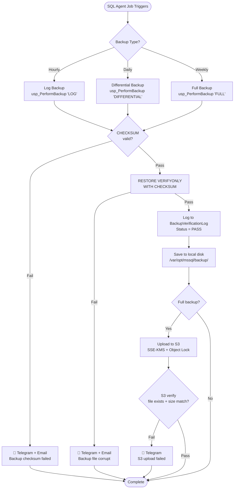

### 3.3 Alert Escalation

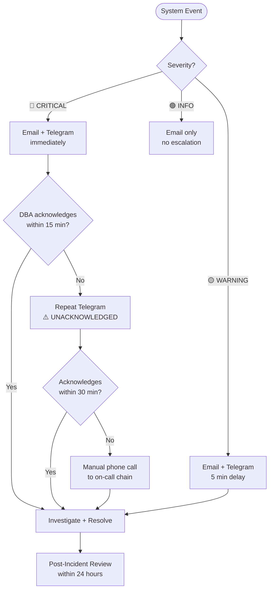

**Reference**: [ESCALATION_POLICY.md](ESCALATION_POLICY.md) | [COMMUNICATION_PLAN.md](COMMUNICATION_PLAN.md)

### 3.4 Morning Dashboard Check

**What to check every morning (5 minutes)**:

| Dashboard | Panel | Green | Yellow | Red |
| --- | --- | --- | --- | --- |
| **Backup Health** | Last Log Backup | < 1 hour ago | 1-2 hours | > 2 hours (RPO breach) |
| **Backup Health** | Last Full Backup | < 7 days | 7-10 days | > 10 days |
| **Backup Health** | Verification | 100% pass | Any fail in 7 days | Fail in last 24h |
| **DB Availability** | Database Status | ONLINE | RECOVERING | OFFLINE |
| **DB Availability** | Disk Usage | < 60% | 60-80% | > 80% |
| **DB Availability** | Cert Expiry | > 60 days | 30-60 days | < 30 days |
| **Security** | Failed Logins/hour | < 5 | 5-20 | > 20 (brute force?) |
| **Security** | RBAC Violations | 0 | 1-5 | > 5 (investigate!) |

**When to escalate**: Any red panel. Any yellow panel persisting > 24 hours.

---

## 4. Maintenance Calendar

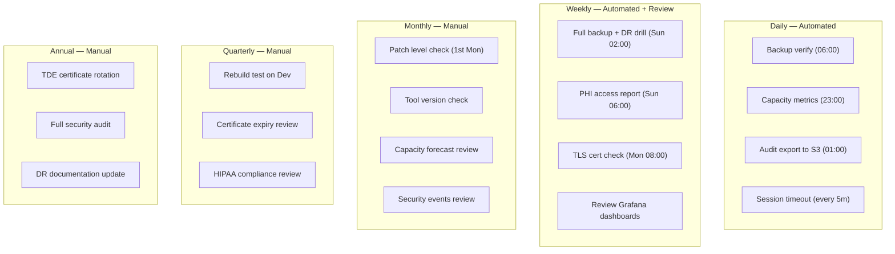

**Reference**: [MAINTENANCE_GUIDE.md](../docs/MAINTENANCE_GUIDE.md)

---

## 5. Change Management

### Dev to Staging to Production

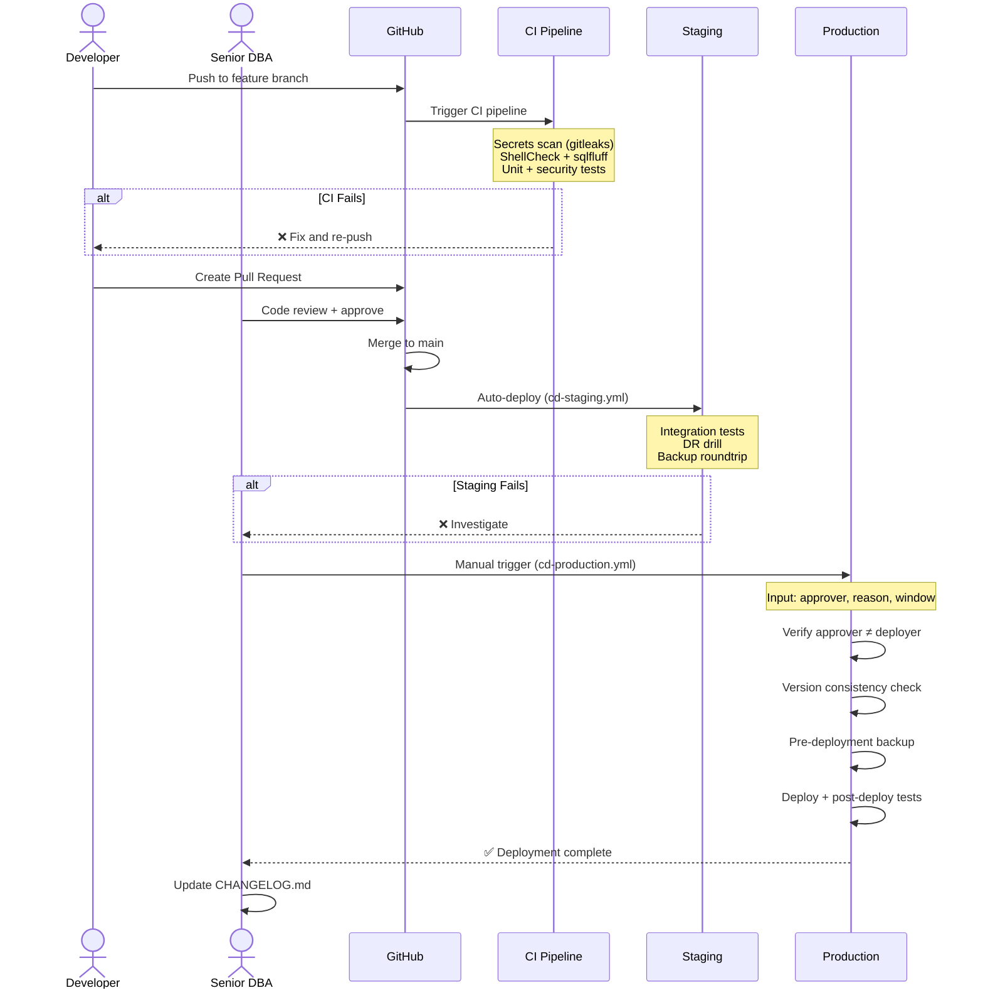

| Gate | Who | Automated? |
| --- | --- | --- |
| CI pipeline (lint, test, scan) | System | Yes — every push |
| Code review | Senior DBA | Manual |
| Staging deploy | System | Yes — on merge |
| Staging tests | System | Yes |
| Production trigger | Senior DBA | Manual (workflow_dispatch) |
| Self-approval check | System | Yes — enforced in code |
| Post-deploy verification | System | Yes |

**Reference**: [DEPLOYMENT_PIPELINE.md](DEPLOYMENT_PIPELINE.md)

---

## 6. Secret Rotation

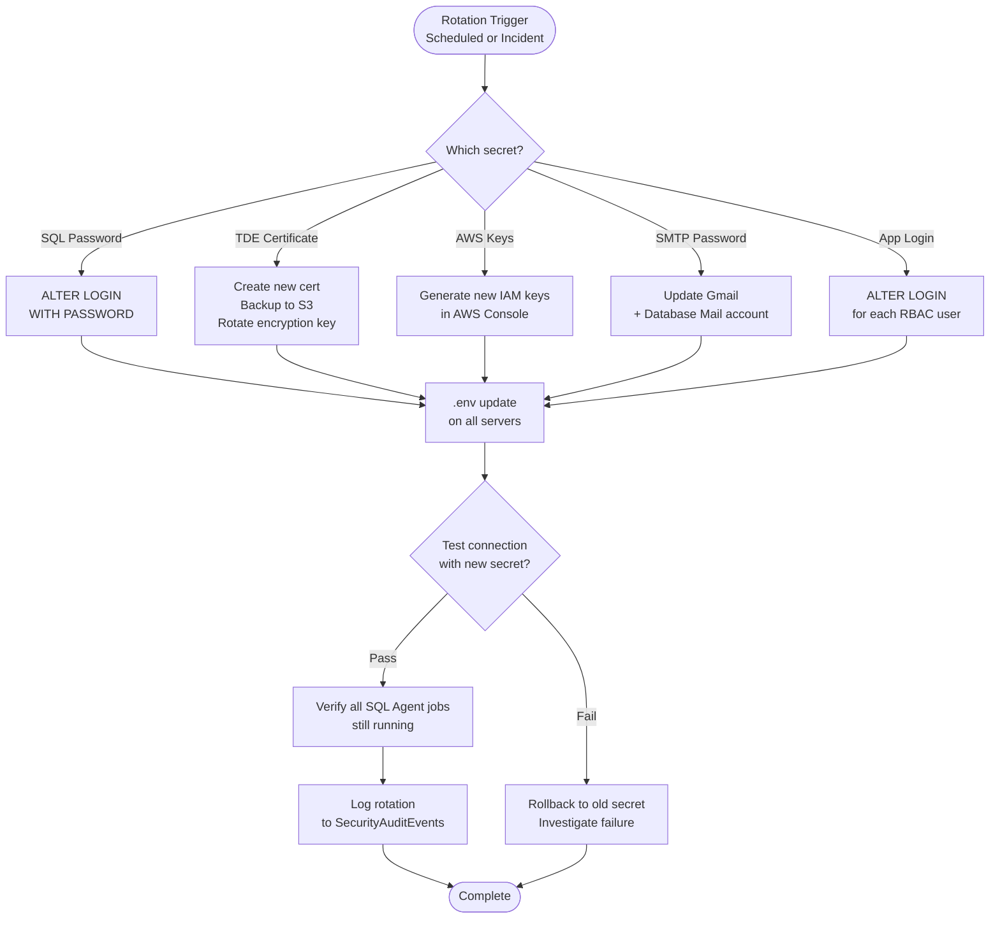

| Secret | Rotation | Runbook |
| --- | --- | --- |
| SQL SA / DBA Admin | Every 90 days | [SECRETS_ROTATION_RUNBOOK.md](SECRETS_ROTATION_RUNBOOK.md) |
| RBAC app logins (4) | Every 90 days | [SECRETS_ROTATION_RUNBOOK.md](SECRETS_ROTATION_RUNBOOK.md) |
| TDE Certificate | Annually | [KEY_ROTATION_RUNBOOK.md](KEY_ROTATION_RUNBOOK.md) |
| Master Key | Annually | [KEY_ROTATION_RUNBOOK.md](KEY_ROTATION_RUNBOOK.md) |
| SMTP Password | When changed in Gmail | [SECRETS_ROTATION_RUNBOOK.md](SECRETS_ROTATION_RUNBOOK.md) |
| AWS Keys | Every 90 days | [SECRETS_ROTATION_RUNBOOK.md](SECRETS_ROTATION_RUNBOOK.md) |

---

## 7. Disaster Recovery

### 7.1 DR Decision Tree

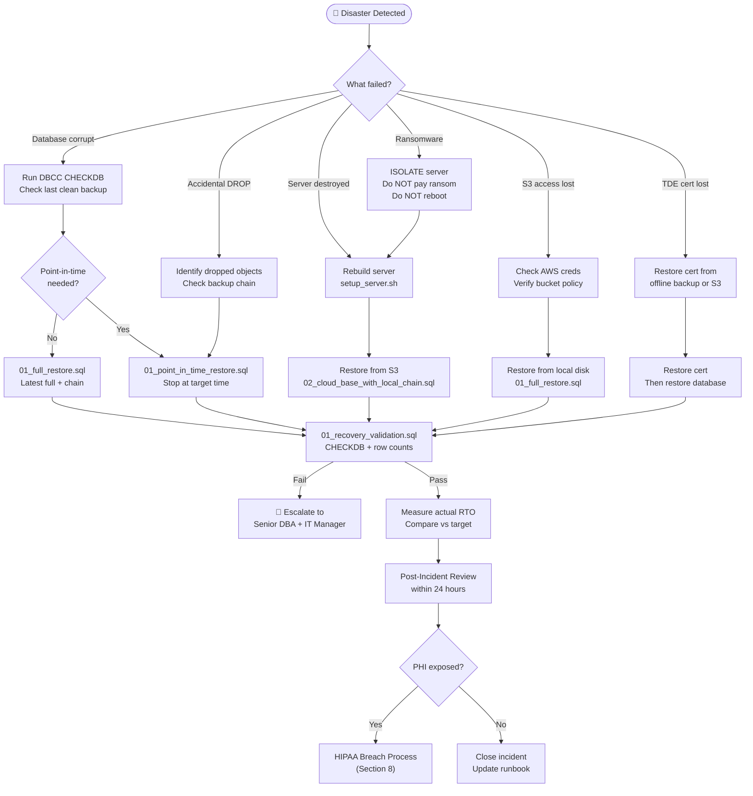

### 7.2 Recovery Targets (10 Scenarios)

| # | Scenario | Severity | RPO | RTO Target | Recovery Script |
| --- | --- | --- | --- | --- | --- |
| DS-001 | Ransomware encryption | Critical | 1h | 4h | `01_ransomware_drill.sql` |
| DS-002 | Accidental DROP TABLE | High | 2h | 2h | `01_point_in_time_restore.sql` |
| DS-003 | Disk drive failure | Critical | 1h | 3h | `01_full_restore.sql` |
| DS-004 | SQL injection mass DELETE | Critical | 4h | 3h | `01_point_in_time_restore.sql` |
| DS-005 | DB corruption (power failure) | High | 2h | 4h | `01_full_restore.sql` |
| DS-006 | Complete server failure | Critical | 1h | 6h | `02_cloud_base_with_local_chain.sql` |
| DS-007 | Ransomware + local backups | Critical | 12h | 5h | `01_restore_full_from_s3.sql` |
| DS-008 | App bug data inconsistency | Medium | 6h | 3h | `01_point_in_time_restore.sql` |
| DS-009 | Datacenter outage | Critical | 4h | 8h | `01_restore_full_from_s3.sql` |
| DS-010 | Malicious insider | Critical | 24h | 6h | S3 immutable backup restore |

**Measured performance** (DR drill 2026-01-09):
- RTO actual: **1.43 minutes** (target: 4 hours) — 98% margin
- RPO actual: **~3 minutes** (target: 1 hour) — 95% margin

### 7.3 Recovery Scripts

| Script | Path | What It Does |
| --- | --- | --- |
| Full restore | `phase4-recovery/full-restore/01_full_restore.sql` | Latest full backup to `_Recovery` DB |
| Cloud-chain | `phase4-recovery/full-restore/02_cloud_base_with_local_chain.sql` | S3 full + local diff + log chain |
| S3 restore | `phase4-recovery/from-s3/01_restore_full_from_s3.sql` | Direct restore from S3 URL |
| PITR | `phase4-recovery/point-in-time/01_point_in_time_restore.sql` | Restore to specific timestamp |
| Validation | `phase4-recovery/testing/01_recovery_validation.sql` | CHECKDB + row counts on restored DBs |

---

## 8. HIPAA Breach Response

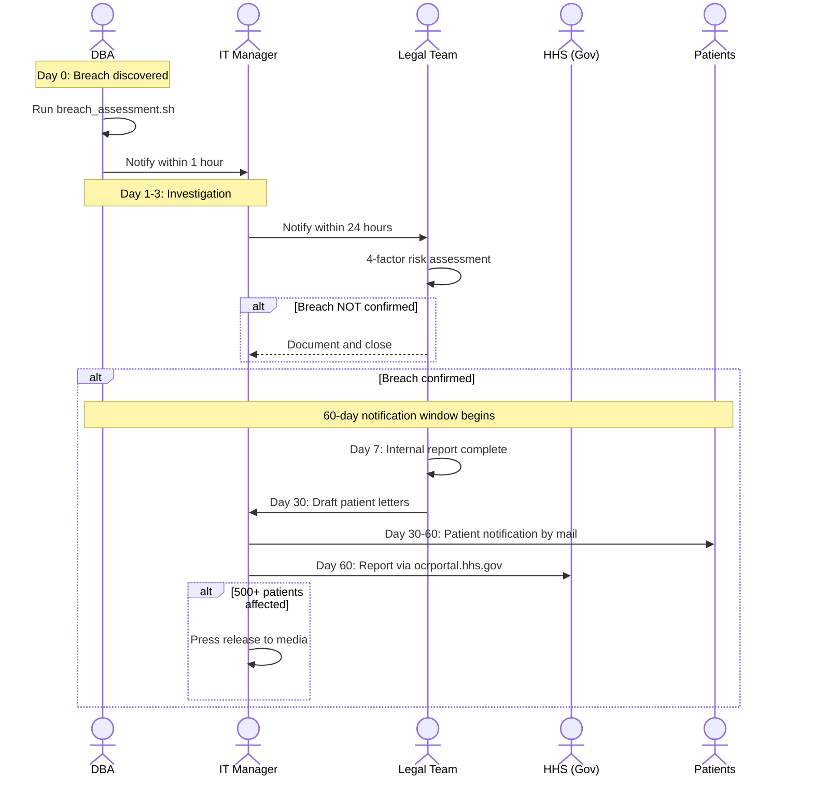

### Breach Classification

| Size | HHS Notification | Media | Timeline |
| --- | --- | --- | --- |
| < 500 individuals | Annual report | No | End of calendar year |
| >= 500 individuals | Immediate | Yes (if same state) | Within 60 days |

### Key Contacts

| Role | Responsibility | When Notified |
| --- | --- | --- |
| On-call DBA | Initial detection + containment | Immediately |
| IT Manager | Incident coordination | Within 1 hour |
| Legal Team | Risk assessment + notifications | Within 24 hours |
| Hospital Director | Patient care impact decisions | If outage > 30 min |
| HHS | Government reporting | Within 60 days (if breach) |

**Reference**: [HIPAA_BREACH_NOTIFICATION.md](HIPAA_BREACH_NOTIFICATION.md) | [POST_INCIDENT_REVIEW_TEMPLATE.md](POST_INCIDENT_REVIEW_TEMPLATE.md)

---

## Quick Reference: All Runbooks

| Situation | Runbook |
| --- | --- |
| Server rebuild from scratch | [INFRASTRUCTURE_RUNBOOK.md](INFRASTRUCTURE_RUNBOOK.md) |
| Disk space > 80% | [CAPACITY_REMEDIATION_RUNBOOK.md](CAPACITY_REMEDIATION_RUNBOOK.md) |
| Rotate passwords | [SECRETS_ROTATION_RUNBOOK.md](SECRETS_ROTATION_RUNBOOK.md) |
| Rotate TDE certificate | [KEY_ROTATION_RUNBOOK.md](KEY_ROTATION_RUNBOOK.md) |
| Deploy to production | [DEPLOYMENT_PIPELINE.md](DEPLOYMENT_PIPELINE.md) |
| Rollback a bad deploy | [ROLLBACK_RUNBOOK.md](ROLLBACK_RUNBOOK.md) |
| Incident response | [COMMUNICATION_PLAN.md](COMMUNICATION_PLAN.md) + [ESCALATION_POLICY.md](ESCALATION_POLICY.md) |
| PHI breach detected | [HIPAA_BREACH_NOTIFICATION.md](HIPAA_BREACH_NOTIFICATION.md) |
| After any incident | [POST_INCIDENT_REVIEW_TEMPLATE.md](POST_INCIDENT_REVIEW_TEMPLATE.md) |
| SQL Server patching | [PATCHING_SCHEDULE.md](PATCHING_SCHEDULE.md) |
| Network/TLS issues | [NETWORK_SECURITY.md](NETWORK_SECURITY.md) |
| Routine maintenance | [MAINTENANCE_GUIDE.md](MAINTENANCE_GUIDE.md) |
